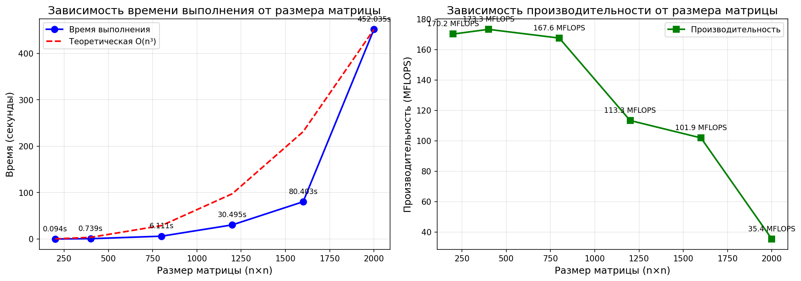

Выполнила: Маркова Юлия 6211-100503D
Дата выполнения: 01.03.2026

1. Задание лабораторной работы

Разработать программу на языке C++ для перемножения двух квадратных матриц.

Требования:
Исходные данные: файлы matrix_A.txt и matrix_B.txt, содержащие значения матриц
Выходные данные: файл result.txt с результатом умножения
Обязательный вывод: время выполнения и объем задачи
Автоматизированная верификация с помощью Python/NumPy
Проведение экспериментов для разных размеров матриц (200, 400, 800, 1200, 1600, 2000) при последовательных вычислениях
Реализация умножения матриц циклами 

2. Теоретическая часть
Для двух квадратных матриц A и B размером n×n произведение C = A × B вычисляется по формуле:

C[i][j] = Σ(k=1 to n) A[i][k] · B[k][j]

Вычислительная сложность: O(n³)
Количество операций: 2n³ (n³ умножений и n³ сложений)

В данной работе реализован классический алгоритм перемножения матриц с использованием трех вложенных циклов (порядок i, j, k). Алгоритм имеет следующие особенности:

Внешний цикл проходит по строкам матрицы A (i)
Средний цикл проходит по столбцам матрицы B (j)
Внутренний цикл выполняет скалярное произведение (k)
Для измерения времени выполнения используется библиотека chrono с точностью до микросекунд. Для автоматической верификации результатов применяется библиотека NumPy языка Python.

3. Реализация программы
Структура проекта:

lab1/
 main.cpp          # Главный модуль с экспериментами
 functions.h       # Заголовочный файл
 functions.cpp     # Реализация функций
 result_200.txt    # Результат умножения для матрицы 200×200
 experiment_results.txt  # Результаты всех экспериментов
 verify.py         # Скрипт верификации

Основные функции:

generateMatrix – автоматическая генерация матриц заданного размера для экспериментов
readMatrix – загрузка матриц из текстовых файлов
multiplyMatricesSequential – последовательное умножение матриц с использованием трех вложенных циклов
saveResult – сохранение результата в файл с подробным отчетом
saveExperimentResults – сохранение таблицы экспериментальных данных и выводов
verifyResult – автоматическая верификация результата

Алгоритм умножения:

for (int i = 0; i < n; i++) {
    for (int j = 0; j < n; j++) {
        double sum = 0;
        for (int k = 0; k < n; k++) {
            sum += A[i][k] * B[k][j];
        }
        C[i][j] = sum;
    }
}
Время выполнения измеряется с помощью high_resolution_clock с точностью до микросекунд. Для каждого размера матрицы программа автоматически:

Генерирует матрицы A и B
Выполняет умножение с замером времени
Сохраняет результат для размера 200×200
Выполняет верификацию результата
Для верификации используется отдельный Python-скрипт с библиотекой NumPy, который сравнивает полученный результат с эталонным.

4. Сборка и запуск

# Компиляция 
g++ -O2 main.cpp functions.cpp -o matrix_mult.exe

# Запуск программы
.\matrix_mult.exe

# Запуск верификации
py verify.py

5. Результаты экспериментов

Результат для матрицы 200×200

РЕЗУЛЬТАТЫ ЭКСПЕРИМЕНТА
Размер матрицы: 200x200
Количество потоков: 1
Время выполнения: 0.094006 секунд
Количество операций: 16000000.000000
Производительность: 170.20 MFLOPS

Верификация: успешно

Эксперименты для разных размеров матриц

========================================
ЭКСПЕРИМЕНТЫ ПО ПЕРЕМНОЖЕНИЮ МАТРИЦ
========================================

Размер матрицы: 200x200
Выполняется умножение (последовательное)... Готово
Время: 0.0940 сек
Производительность: 170.20 MFLOPS

Размер матрицы: 400x400
Выполняется умножение (последовательное)... Готово
Время: 0.7386 сек
Производительность: 173.30 MFLOPS

Размер матрицы: 800x800
Выполняется умножение (последовательное)... Готово
Время: 6.1112 сек
Производительность: 167.56 MFLOPS

Размер матрицы: 1200x1200
Выполняется умножение (последовательное)... Готово
Время: 30.4954 сек
Производительность: 113.33 MFLOPS

Размер матрицы: 1600x1600
Выполняется умножение (последовательное)... Готово
Время: 80.4029 сек
Производительность: 101.89 MFLOPS

Размер матрицы: 2000x2000
Выполняется умножение (последовательное)... Готово
Время: 452.0348 сек
Производительность: 35.40 MFLOPS

Таблица результатов
Размер матрицы	Время выполнения (сек)	Производительность (MFLOPS)
200 × 200	0.0940	170.20
400 × 400	0.7386	173.30
800 × 800	6.1112	167.56
1200 × 1200	30.4954	113.33
1600 × 1600	80.4029	101.89
2000 × 2000	452.0348	35.40

6. Вывод
В ходе выполнения лабораторной работы была разработана программа для перемножения квадратных матриц с использованием последовательного алгоритма (три вложенных цикла). Были проведены эксперименты для шести различных размеров матриц: 200, 400, 800, 1200, 1600 и 2000.

Анализ полученных результатов:

С увеличением размера матрицы время выполнения растет кубически (O(n³)), что соответствует теоретической оценке сложности алгоритма.

При размерах до 800×800 производительность остается стабильной (около 170 MFLOPS), что связано с эффективным использованием кэш-памяти процессора.

Начиная с размера 1200×1200 наблюдается снижение производительности, что объясняется увеличением количества кэш-промахов при работе с большими объемами данных.

При размере 2000×2000 производительность падает до 35.40 MFLOPS, так как матрицы перестают помещаться в кэш-память, и процессор вынужден часто обращаться к оперативной памяти.

Верификация: Для всех экспериментов результаты были успешно проверены с помощью Python/NumPy, что подтверждает корректность работы программы.

Вывод по лабораторной работе: Программа успешно компилируется и работает в среде Windows. Все поставленные задачи решены, проведены эксперименты для различных размеров матриц, получены и проанализированы результаты. Лабораторная работа выполнена в полном объеме.

Все файлы программы, результаты экспериментов и отчет загружены в репозиторий GitHub.