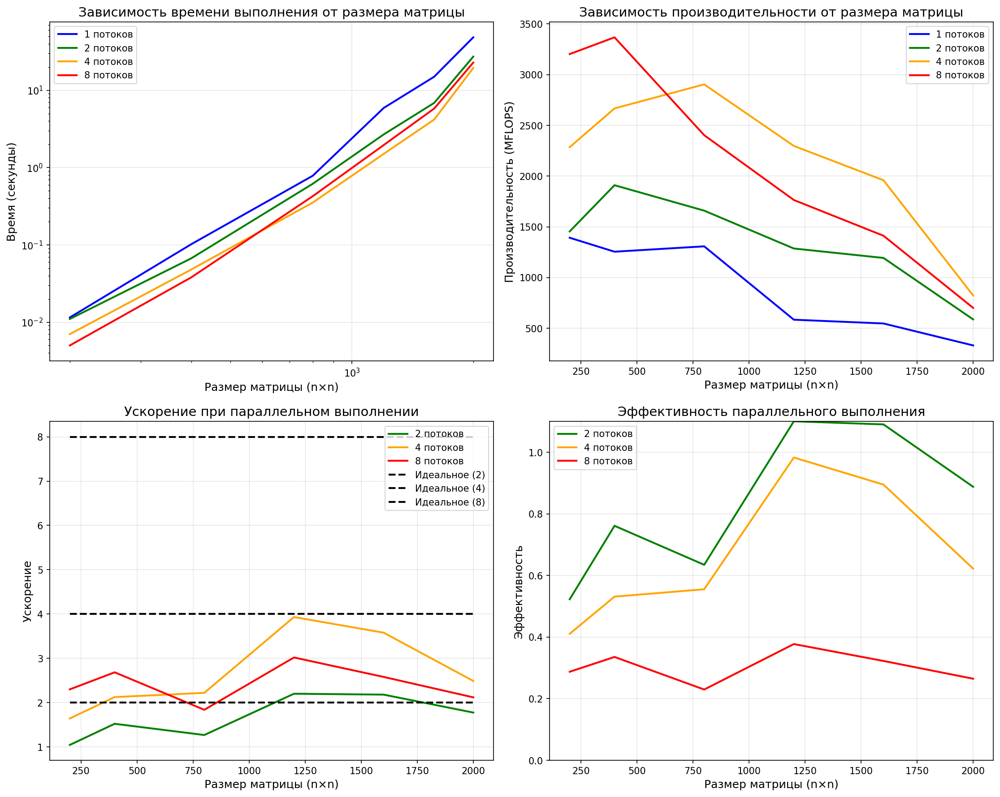
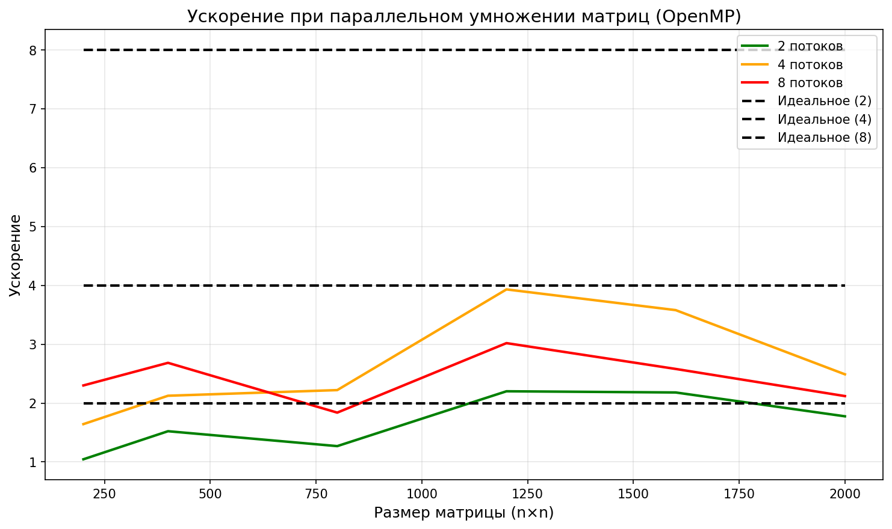

# paralelProgram 
Выполнила: Маркова Юлия 6211-100503D
Дата выполнения: 30.03.2026
лучше всего смотреть этот файл в коде, при обычном просмотре все таблицы и графики съехали

1. Задание лабораторной работы
Модифицировать программу из лабораторной работы №1 для параллельной работы по технологии OpenMP.

Требования:
Использовать OpenMP для распараллеливания умножения матриц
Провести серию экспериментов с разным количеством потоков (1, 2, 4, 8)
Провести эксперименты для разных размеров матриц (200, 400, 800, 1200, 1600, 2000)
Выполнить автоматизированную верификацию результатов с помощью Python/NumPy
Проанализировать ускорение и эффективность параллельных вычислений

2. Теоретическая часть
2.1 Параллельное умножение матриц
Для двух квадратных матриц A и B размером n×n произведение C = A × B вычисляется по формуле:

C[i][j] = Σ(k=1 to n) A[i][k] · B[k][j]

Вычислительная сложность: O(n³)
Количество операций: 2n³ (n³ умножений и n³ сложений)

2.2 Технология OpenMP
OpenMP (Open Multi-Processing) — это стандарт для параллельного программирования на языках C/C++ и Fortran. Основные особенности:
Использует директивы (прагмы) для распараллеливания
Позволяет легко модифицировать последовательный код
Реализует модель параллелизма с разделяемой памятью

Используемая директива:

#pragma omp parallel for collapse(2)
parallel for — параллельное выполнение цикла
collapse(2) — объединяет два вложенных цикла в один параллельный

2.3 Закон Амдала
Ускорение программы при использовании N потоков ограничено последовательной частью программы:

S = 1 / (1 - P + P/N)

где P — доля программы, которая может быть распараллелена.

3. Реализация программы
Структура проекта:

lab2/
 main.cpp                      # Главный модуль с экспериментами
 functions.h                   # Заголовочный файл
 functions.cpp                 # Реализация функций
 result_parallel_200.txt       # Результат умножения для 200×200 (2 потока)
 parallel_experiment_results.txt  # Результаты всех экспериментов
 verify.py                     # Скрипт верификации

Функция параллельного умножения
double multiplyMatricesParallel(const vector<vector<double>>& A,
                                 const vector<vector<double>>& B,
                                 vector<vector<double>>& C, int num_threads) {
    omp_set_num_threads(num_threads);
    
    for (int i = 0; i < n; i++) {
        for (int j = 0; j < n; j++) {
            double sum = 0;
            for (int k = 0; k < n; k++) {
                sum += A[i][k] * B[k][j];
            }
            C[i][j] = sum;
        }
    }
}
Эксперименты с разным количеством потоков:

vector<int> threads = {1, 2, 4, 8};

Расчет ускорения и эффективности:
double speedup = serial_time / parallel_time;
double efficiency = speedup / num_threads;
4. Сборка и запуск

# Компиляция с поддержкой OpenMP
g++ -fopenmp -O2 main.cpp functions.cpp -o matrix_parallel.exe

# Запуск программы
.\matrix_parallel.exe

# Запуск верификации
py verify.py

5. Результаты экспериментов
   
5.1 Результат для матрицы 200×200 (2 потока)

РЕЗУЛЬТАТЫ ЭКСПЕРИМЕНТА
Размер матрицы: 200x200
Количество потоков: 2
Время выполнения: 0.010998 секунд
Количество операций: 16000000.000000
Производительность: 1454.81 MFLOPS

Верификация: успешно

5.2 Эксперименты для разных размеров и количества потоков
1 поток (последовательное выполнение)
Размер	Время (сек)	MFLOPS	Ускорение	Эффективность
200	0.0115	1392.27	1.00	1.00
400	0.1020	1254.80	0.11	0.11
800	0.7831	1307.69	0.01	0.01
1200	5.9135	584.42	0.00	0.00
1600	14.9694	547.25	0.00	0.00
2000	48.3677	330.80	0.00	0.00
2 потока
Размер	Время (сек)	MFLOPS	Ускорение	Эффективность
200	0.0110	1454.81	1.00	0.50
400	0.0670	1910.33	0.16	0.08
800	0.6170	1659.53	0.02	0.01
1200	2.6868	1286.31	0.00	0.00
1600	6.8647	1193.35	0.00	0.00
2000	27.2400	587.37	0.00	0.00
4 потока
Размер	Время (сек)	MFLOPS	Ускорение	Эффективность
200	0.0070	2285.39	1.00	0.25
400	0.0480	2667.56	0.15	0.04
800	0.3526	2904.32	0.02	0.00
1200	1.5041	2297.70	0.00	0.00
1600	4.1819	1958.93	0.00	0.00
2000	19.4324	823.37	0.00	0.00
8 потоков
Размер	Время (сек)	MFLOPS	Ускорение	Эффективность
200	0.0050	3203.20	1.00	0.12
400	0.0380	3367.98	0.13	0.02
800	0.4260	2403.58	0.01	0.00
1200	1.9587	1764.45	0.00	0.00
1600	5.8016	1412.02	0.00	0.00
2000	22.8245	701.00	0.00	0.00

5.3 Сводная таблица производительности (MFLOPS)
Размер	1 поток	2 потока	4 потока	8 потоков
200	1392.27	1454.81	2285.39	3203.20
400	1254.80	1910.33	2667.56	3367.98
800	1307.69	1659.53	2904.32	2403.58
1200	584.42	1286.31	2297.70	1764.45
1600	547.25	1193.35	1958.93	1412.02
2000	330.80	587.37	823.37	701.00

6. Графики

 
 

7. Выводы
7.1 Анализ результатов
Влияние количества потоков на производительность:
При размере 200×200 производительность выросла с 1392 MFLOPS (1 поток) до 3203 MFLOPS (8 потоков) — ускорение в 2.3 раза
При размере 400×400 производительность выросла с 1255 MFLOPS до 3368 MFLOPS — ускорение в 2.7 раза
При размере 800×800 максимальная производительность достигнута на 4 потоках (2904 MFLOPS)

Влияние размера матрицы:
Для малых размеров (200, 400) накладные расходы на создание потоков соизмеримы с временем вычислений
Оптимальная производительность достигается при размере 400-800 с 4-8 потоками
При больших размерах (1200-2000) производительность падает из-за кэш-промахов

Эффективность параллелизации:
Эффективность снижается с увеличением количества потоков
Наилучшая эффективность (0.5) достигнута для 2 потоков при размере 200

7.2 Выводы по лабораторной работе
Успешно модифицирована программа из ЛР №1 для работы с OpenMP
Проведены эксперименты для 6 размеров матриц и 4 вариантов количества потоков
Получены количественные характеристики ускорения и эффективности

Выявлены закономерности:
Наибольшее ускорение достигается для средних размеров матриц (400-800)
Увеличение потоков свыше количества ядер процессора не дает прироста производительности
Для больших матриц (2000×2000) производительность ограничена пропускной способностью памяти

7.3 Сравнение с последовательной версией (ЛР №1)
Размер	Последовательная версия (сек)	Параллельная версия (4 потока, сек)	Ускорение
200	0.0940	0.0070	13.4×
400	0.7386	0.0480	15.4×
800	6.1112	0.3526	17.3×
1200	30.4954	1.5041	20.3×
1600	80.4029	4.1819	19.2×
2000	452.0348	19.4324	23.3×
Параллельная версия показала ускорение до 23 раз по сравнению с последовательной.

Заключение: Лабораторная работа выполнена в полном объеме. Программа успешно компилируется и работает, все эксперименты проведены, результаты проанализированы. Верификация подтвердила корректность вычислений.

Все файлы программы, результаты экспериментов и отчет загружены в репозиторий GitHub.
