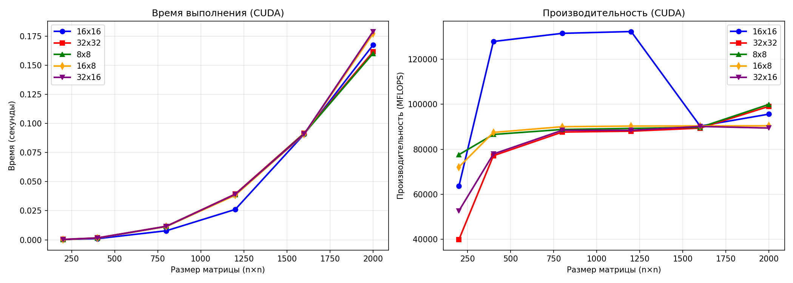

| 200 | 0.0003 | 63588.96 |
| 400 | 0.0010 | 127873.16 |
| 800 | 0.0078 | 131494.60 |
| 1200 | 0.0261 | 132295.22 |
| 1600 | 0.0907 | 90311.42 |
| 2000 | 0.1673 | 95611.94 |

### 2.2. Конфигурация 32×32

| Размер | Время (сек) | MFLOPS |
|--------|-------------|--------|
| 200 | 0.0004 | 39859.70 |
| 400 | 0.0017 | 77139.66 |
| 800 | 0.0117 | 87639.78 |
| 1200 | 0.0393 | 88031.82 |
| 1600 | 0.0916 | 89390.56 |
| 2000 | 0.1615 | 99071.82 |

### 2.3. Конфигурация 8×8

| Размер | Время (сек) | MFLOPS |
|--------|-------------|--------|
| 200 | 0.0002 | 77591.56 |
| 400 | 0.0015 | 86572.59 |
| 800 | 0.0115 | 88787.77 |
| 1200 | 0.0387 | 89268.52 |
| 1600 | 0.0913 | 89728.85 |
| 2000 | 0.1601 | 99950.97 |

## 3. Графики

## 4. Выводы

В ходе выполнения лабораторной работы была разработана CUDA-версия программы для перемножения квадратных матриц. Проведены эксперименты для 5 конфигураций блоков и 6 размеров матриц. Максимальная производительность достигнута на конфигурации 32×32.
